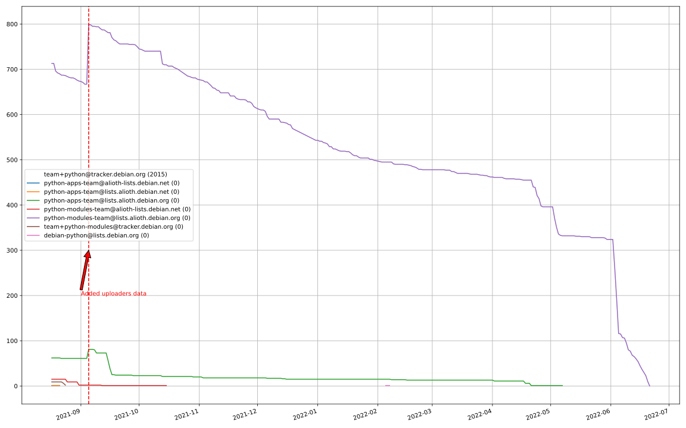

# debian-python-team-tracker

As announced [here](https://lists.debian.org/debian-python/2021/08/msg00006.html), there's an ongoing effort to consolidate the Maintainer and Uploaders fields of the Python Team packages to use `team+python@tracker.debian.org` (from the old Alioth addresses and various other variations).

This repo is to track that effort, here's the results:

# Packages with outdated email address

## `python-modules-team@lists.alioth.debian.org`
Total packages: 236

<b>1..50</b>

| # | Package | Version |
| --- | --- | --- |
| 1 | [colorclass](https://tracker.debian.org/colorclass) | 2.2.0-2.2 |
| 2 | [cookiecutter](https://tracker.debian.org/cookiecutter) | 1.7.3-1 |
| 3 | [debiancontributors](https://tracker.debian.org/debiancontributors) | 0.7.8-2 |
| 4 | [devpi-common](https://tracker.debian.org/devpi-common) | 3.2.2-1.1 |
| 5 | [django-bitfield](https://tracker.debian.org/django-bitfield) | 1.9.6-2 |
| 6 | [django-hvad](https://tracker.debian.org/django-hvad) | 1.8.0-1.1 |
| 7 | [django-js-reverse](https://tracker.debian.org/django-js-reverse) | 0.7.3-1.1 |
| 8 | [django-nose](https://tracker.debian.org/django-nose) | 1.4.6-2.1 |
| 9 | [django-pipeline](https://tracker.debian.org/django-pipeline) | 1.6.14-3 |
| 10 | [dnsdiag](https://tracker.debian.org/dnsdiag) | 2.0.2-1 |
| 11 | [faker](https://tracker.debian.org/faker) | 0.9.3-0.1 |
| 12 | [fastchunking](https://tracker.debian.org/fastchunking) | 0.0.3-2 |
| 13 | [flask-api](https://tracker.debian.org/flask-api) | 1.1+dfsg-1.1 |
| 14 | [flask-ldapconn](https://tracker.debian.org/flask-ldapconn) | 0.7.2-1.1 |
| 15 | [flask-mail](https://tracker.debian.org/flask-mail) | 0.9.1+dfsg1-1.1 |
| 16 | [flask-script](https://tracker.debian.org/flask-script) | 2.0.6-2 |
| 17 | [hachoir](https://tracker.debian.org/hachoir) | 3.1.0+dfsg-3 |
| 18 | [kivy](https://tracker.debian.org/kivy) | 1.11.0-2 |
| 19 | [mockldap](https://tracker.debian.org/mockldap) | 0.3.0-4 |
| 20 | [networkx](https://tracker.debian.org/networkx) | 2.5+ds-2 |
| 21 | [okasha](https://tracker.debian.org/okasha) | 0.2.4-4 |
| 22 | [portio](https://tracker.debian.org/portio) | 0.5-4 |
| 23 | [power](https://tracker.debian.org/power) | 1.4+dfsg-4 |
| 24 | [pycallgraph](https://tracker.debian.org/pycallgraph) | 1.1.3-1.2 |
| 25 | [pydenticon](https://tracker.debian.org/pydenticon) | 0.3.1-2 |
| 26 | [pydle](https://tracker.debian.org/pydle) | 0.9.4-2 |
| 27 | [pyfg](https://tracker.debian.org/pyfg) | 0.50-2 |
| 28 | [pyinotify](https://tracker.debian.org/pyinotify) | 0.9.6-1.3 |
| 29 | [pyiosxr](https://tracker.debian.org/pyiosxr) | 0.52-1.1 |
| 30 | [pylibmc](https://tracker.debian.org/pylibmc) | 1.5.2-3 |
| 31 | [pynliner](https://tracker.debian.org/pynliner) | 0.8.0-2 |
| 32 | [pyopengl](https://tracker.debian.org/pyopengl) | 3.1.5+dfsg-1 |
| 33 | [pyprind](https://tracker.debian.org/pyprind) | 2.11.2-2 |
| 34 | [pysimplesoap](https://tracker.debian.org/pysimplesoap) | 1.16.2-3 |
| 35 | [pytds](https://tracker.debian.org/pytds) | 1.10.0-1 |
| 36 | [pytest-bdd](https://tracker.debian.org/pytest-bdd) | 3.2.1-1 |
| 37 | [pytest-runner](https://tracker.debian.org/pytest-runner) | 2.11.1-1.2 |
| 38 | [python-aioinflux](https://tracker.debian.org/python-aioinflux) | 0.9.0-2 |
| 39 | [python-base58](https://tracker.debian.org/python-base58) | 1.0.3-1.1 |
| 40 | [python-box](https://tracker.debian.org/python-box) | 3.4.6-2 |
| 41 | [python-click-log](https://tracker.debian.org/python-click-log) | 0.2.1-2 |
| 42 | [python-colour](https://tracker.debian.org/python-colour) | 0.1.5-2 |
| 43 | [python-consul](https://tracker.debian.org/python-consul) | 0.7.1-1.1 |
| 44 | [python-decorator](https://tracker.debian.org/python-decorator) | 4.4.2-2 |
| 45 | [python-demjson](https://tracker.debian.org/python-demjson) | 2.2.4-5 |
| 46 | [python-django-push-notifications](https://tracker.debian.org/python-django-push-notifications) | 1.4.1-1 |
| 47 | [python-django-simple-history](https://tracker.debian.org/python-django-simple-history) | 2.7.0-1.1 |
| 48 | [python-envs](https://tracker.debian.org/python-envs) | 1.2.6-1.1 |
| 49 | [python-etcd](https://tracker.debian.org/python-etcd) | 0.4.5-2 |
| 50 | [python-ewmh](https://tracker.debian.org/python-ewmh) | 0.1.6-2 |

<b>51..100</b>

| # | Package | Version |
| --- | --- | --- |
| 51 | [python-gflags](https://tracker.debian.org/python-gflags) | 1.5.1-7 |
| 52 | [python-hpilo](https://tracker.debian.org/python-hpilo) | 4.3-3 |
| 53 | [python-iniparse](https://tracker.debian.org/python-iniparse) | 0.4-3 |
| 54 | [python-ipfix](https://tracker.debian.org/python-ipfix) | 0.9.7-2 |
| 55 | [python-junit-xml](https://tracker.debian.org/python-junit-xml) | 1.9-1 |
| 56 | [python-kanboard](https://tracker.debian.org/python-kanboard) | 1.0.1-1.1 |
| 57 | [python-ldap](https://tracker.debian.org/python-ldap) | 3.2.0-4 |
| 58 | [python-libguess](https://tracker.debian.org/python-libguess) | 1.1-4 |
| 59 | [python-mailer](https://tracker.debian.org/python-mailer) | 0.8.1-4 |
| 60 | [python-mastodon](https://tracker.debian.org/python-mastodon) | 1.5.1-1 |
| 61 | [python-mccabe](https://tracker.debian.org/python-mccabe) | 0.6.1-3 |
| 62 | [python-measurement](https://tracker.debian.org/python-measurement) | 2.0.1-2 |
| 63 | [python-meld3](https://tracker.debian.org/python-meld3) | 1.0.2-3 |
| 64 | [python-mnemonic](https://tracker.debian.org/python-mnemonic) | 0.19-1 |
| 65 | [python-model-mommy](https://tracker.debian.org/python-model-mommy) | 1.6.0-2 |
| 66 | [python-morris](https://tracker.debian.org/python-morris) | 1.2-2 |
| 67 | [python-multidict](https://tracker.debian.org/python-multidict) | 5.1.0-1 |
| 68 | [python-nine](https://tracker.debian.org/python-nine) | 1.1.0-1 |
| 69 | [python-noise](https://tracker.debian.org/python-noise) | 1.2.3-3 |
| 70 | [python-notify2](https://tracker.debian.org/python-notify2) | 0.3-4 |
| 71 | [python-ntlm-auth](https://tracker.debian.org/python-ntlm-auth) | 1.4.0-1 |
| 72 | [python-offtrac](https://tracker.debian.org/python-offtrac) | 0.1.0-2.1 |
| 73 | [python-openid-cla](https://tracker.debian.org/python-openid-cla) | 1.2-2 |
| 74 | [python-openid-teams](https://tracker.debian.org/python-openid-teams) | 1.2-2 |
| 75 | [python-openidc-client](https://tracker.debian.org/python-openidc-client) | 0.6.0-1.1 |
| 76 | [python-opentimestamps](https://tracker.debian.org/python-opentimestamps) | 0.4.1-1 |
| 77 | [python-padme](https://tracker.debian.org/python-padme) | 1.1.1-3 |
| 78 | [python-path-and-address](https://tracker.debian.org/python-path-and-address) | 2.0.1-2 |
| 79 | [python-pathtools](https://tracker.debian.org/python-pathtools) | 0.1.2-4 |
| 80 | [python-paypal](https://tracker.debian.org/python-paypal) | 1.2.5-3 |
| 81 | [python-peakutils](https://tracker.debian.org/python-peakutils) | 1.3.3+ds-2 |
| 82 | [python-pem](https://tracker.debian.org/python-pem) | 19.1.0-1 |
| 83 | [python-persistent](https://tracker.debian.org/python-persistent) | 4.6.4-0.2 |
| 84 | [python-pex](https://tracker.debian.org/python-pex) | 1.1.14-3.1 |
| 85 | [python-pgpdump](https://tracker.debian.org/python-pgpdump) | 1.5-2 |
| 86 | [python-pgspecial](https://tracker.debian.org/python-pgspecial) | 1.11.10+dfsg1-1 |
| 87 | [python-phonenumbers](https://tracker.debian.org/python-phonenumbers) | 8.12.1-1 |
| 88 | [python-picklable-itertools](https://tracker.debian.org/python-picklable-itertools) | 0.1.1-3 |
| 89 | [python-plaster](https://tracker.debian.org/python-plaster) | 1.0-2 |
| 90 | [python-plaster-pastedeploy](https://tracker.debian.org/python-plaster-pastedeploy) | 0.5-3 |
| 91 | [python-prctl](https://tracker.debian.org/python-prctl) | 1.7-2 |
| 92 | [python-preshed](https://tracker.debian.org/python-preshed) | 3.0.2-1 |
| 93 | [python-pretend](https://tracker.debian.org/python-pretend) | 1.0.9-1 |
| 94 | [python-prettylog](https://tracker.debian.org/python-prettylog) | 0.1.0-2 |
| 95 | [python-priority](https://tracker.debian.org/python-priority) | 1.3.0-3 |
| 96 | [python-progressbar](https://tracker.debian.org/python-progressbar) | 2.5-2 |
| 97 | [python-pskc](https://tracker.debian.org/python-pskc) | 1.1-3 |
| 98 | [python-py-zipkin](https://tracker.debian.org/python-py-zipkin) | 0.15.0-1.1 |
| 99 | [python-pyftpdlib](https://tracker.debian.org/python-pyftpdlib) | 1.5.4-2 |
| 100 | [python-pygerrit2](https://tracker.debian.org/python-pygerrit2) | 2.0.4-2 |

<b>101..150</b>

| # | Package | Version |
| --- | --- | --- |
| 101 | [python-pypump](https://tracker.debian.org/python-pypump) | 0.7-3 |
| 102 | [python-pysnmp4-apps](https://tracker.debian.org/python-pysnmp4-apps) | 0.3.2-2.2 |
| 103 | [python-pysnmp4-mibs](https://tracker.debian.org/python-pysnmp4-mibs) | 0.1.3-3 |
| 104 | [python-pytest-benchmark](https://tracker.debian.org/python-pytest-benchmark) | 3.2.2-2 |
| 105 | [python-pyvmomi](https://tracker.debian.org/python-pyvmomi) | 6.7.1-3 |
| 106 | [python-rarfile](https://tracker.debian.org/python-rarfile) | 3.1-1 |
| 107 | [python-ratelimiter](https://tracker.debian.org/python-ratelimiter) | 1.2.0.post0-1 |
| 108 | [python-redisearch-py](https://tracker.debian.org/python-redisearch-py) | 1.0.0-1 |
| 109 | [python-releases](https://tracker.debian.org/python-releases) | 1.6.3-1 |
| 110 | [python-repoze.lru](https://tracker.debian.org/python-repoze.lru) | 0.7-2 |
| 111 | [python-repoze.sphinx.autointerface](https://tracker.debian.org/python-repoze.sphinx.autointerface) | 0.8-0.2 |
| 112 | [python-repoze.tm2](https://tracker.debian.org/python-repoze.tm2) | 2.0-2 |
| 113 | [python-requests-ntlm](https://tracker.debian.org/python-requests-ntlm) | 1.1.0-1.1 |
| 114 | [python-requirements-detector](https://tracker.debian.org/python-requirements-detector) | 0.6-2 |
| 115 | [python-rpaths](https://tracker.debian.org/python-rpaths) | 0.13-1.1 |
| 116 | [python-rply](https://tracker.debian.org/python-rply) | 0.7.7-2 |
| 117 | [python-schedutils](https://tracker.debian.org/python-schedutils) | 0.6-2.1 |
| 118 | [python-schema](https://tracker.debian.org/python-schema) | 0.6.7-3 |
| 119 | [python-scp](https://tracker.debian.org/python-scp) | 0.13.0-2 |
| 120 | [python-scripttest](https://tracker.debian.org/python-scripttest) | 1.3-3 |
| 121 | [python-scruffy](https://tracker.debian.org/python-scruffy) | 0.3.3-2 |
| 122 | [python-sdnotify](https://tracker.debian.org/python-sdnotify) | 0.3.1-2 |
| 123 | [python-serverfiles](https://tracker.debian.org/python-serverfiles) | 0.3.0-1 |
| 124 | [python-service-identity](https://tracker.debian.org/python-service-identity) | 18.1.0-6 |
| 125 | [python-sexpdata](https://tracker.debian.org/python-sexpdata) | 0.0.3-2 |
| 126 | [python-shade](https://tracker.debian.org/python-shade) | 1.30.0-3 |
| 127 | [python-shellescape](https://tracker.debian.org/python-shellescape) | 3.4.1-4 |
| 128 | [python-simpy](https://tracker.debian.org/python-simpy) | 2.3.1+dfsg-2 |
| 129 | [python-simpy3](https://tracker.debian.org/python-simpy3) | 3.0.11-2 |
| 130 | [python-slimmer](https://tracker.debian.org/python-slimmer) | 0.1.30-8 |
| 131 | [python-slugify](https://tracker.debian.org/python-slugify) | 4.0.0-1 |
| 132 | [python-smstrade](https://tracker.debian.org/python-smstrade) | 0.2.4-6 |
| 133 | [python-socketpool](https://tracker.debian.org/python-socketpool) | 0.5.3-5 |
| 134 | [python-sphinx-issues](https://tracker.debian.org/python-sphinx-issues) | 1.2.0-2 |
| 135 | [python-spur](https://tracker.debian.org/python-spur) | 0.3.21-1 |
| 136 | [python-statsd](https://tracker.debian.org/python-statsd) | 3.3.0-2 |
| 137 | [python-stopit](https://tracker.debian.org/python-stopit) | 1.1.2-1 |
| 138 | [python-structlog](https://tracker.debian.org/python-structlog) | 20.1.0-1 |
| 139 | [python-sunlight](https://tracker.debian.org/python-sunlight) | 1.1.5-3 |
| 140 | [python-suntime](https://tracker.debian.org/python-suntime) | 1.2.5-2 |
| 141 | [python-tempita](https://tracker.debian.org/python-tempita) | 0.5.2-6 |
| 142 | [python-test-server](https://tracker.debian.org/python-test-server) | 0.0.27-2 |
| 143 | [python-testing.common.database](https://tracker.debian.org/python-testing.common.database) | 2.0.0-2 |
| 144 | [python-testing.mysqld](https://tracker.debian.org/python-testing.mysqld) | 1.4.0-4 |
| 145 | [python-testing.postgresql](https://tracker.debian.org/python-testing.postgresql) | 1.3.0-2 |
| 146 | [python-thriftpy](https://tracker.debian.org/python-thriftpy) | 0.3.9+ds1-1 |
| 147 | [python-tinycss](https://tracker.debian.org/python-tinycss) | 0.4-3 |
| 148 | [python-tktreectrl](https://tracker.debian.org/python-tktreectrl) | 2.0.2-3 |
| 149 | [python-translationstring](https://tracker.debian.org/python-translationstring) | 1.4-1 |
| 150 | [python-twitter](https://tracker.debian.org/python-twitter) | 3.3-2 |

<b>151..200</b>

| # | Package | Version |
| --- | --- | --- |
| 151 | [python-typeguard](https://tracker.debian.org/python-typeguard) | 2.2.2-1.1 |
| 152 | [python-udatetime](https://tracker.debian.org/python-udatetime) | 0.0.16-4 |
| 153 | [python-unicodecsv](https://tracker.debian.org/python-unicodecsv) | 0.14.1-2 |
| 154 | [python-urlobject](https://tracker.debian.org/python-urlobject) | 2.4.3-3 |
| 155 | [python-urwidtrees](https://tracker.debian.org/python-urwidtrees) | 1.0.3.dev0-1 |
| 156 | [python-utils](https://tracker.debian.org/python-utils) | 2.3.0-2 |
| 157 | [python-vagrant](https://tracker.debian.org/python-vagrant) | 0.5.15-3 |
| 158 | [python-venusian](https://tracker.debian.org/python-venusian) | 3.0.0-1 |
| 159 | [python-vobject](https://tracker.debian.org/python-vobject) | 0.9.6.1-0.2 |
| 160 | [python-webob](https://tracker.debian.org/python-webob) | 1:1.8.6-1.1 |
| 161 | [python-wget](https://tracker.debian.org/python-wget) | 3.2-3 |
| 162 | [python-wheezy.template](https://tracker.debian.org/python-wheezy.template) | 0.1.167-2 |
| 163 | [python-whoosh](https://tracker.debian.org/python-whoosh) | 2.7.4+git6-g9134ad92-5 |
| 164 | [python-wither](https://tracker.debian.org/python-wither) | 1.1-2 |
| 165 | [python-wsgilog](https://tracker.debian.org/python-wsgilog) | 0.3.1-3 |
| 166 | [python-yaswfp](https://tracker.debian.org/python-yaswfp) | 0.9.3-1.1 |
| 167 | [python-zc.customdoctests](https://tracker.debian.org/python-zc.customdoctests) | 1.0.1-2 |
| 168 | [python-zipp](https://tracker.debian.org/python-zipp) | 1.0.0-3 |
| 169 | [python-zxcvbn](https://tracker.debian.org/python-zxcvbn) | 4.4.28-2 |
| 170 | [python3-proselint](https://tracker.debian.org/python3-proselint) | 0.10.2-2 |
| 171 | [pythondialog](https://tracker.debian.org/pythondialog) | 3.5.1-1 |
| 172 | [pytoml](https://tracker.debian.org/pytoml) | 0.1.21-1 |
| 173 | [pyuca](https://tracker.debian.org/pyuca) | 1.2-2 |
| 174 | [pyutilib](https://tracker.debian.org/pyutilib) | 5.8.0-1 |
| 175 | [pywavelets](https://tracker.debian.org/pywavelets) | 1.1.1-1 |
| 176 | [pywinrm](https://tracker.debian.org/pywinrm) | 0.3.0-2 |
| 177 | [quark-sphinx-theme](https://tracker.debian.org/quark-sphinx-theme) | 0.5.1-2 |
| 178 | [redis-py-cluster](https://tracker.debian.org/redis-py-cluster) | 2.0.0-1 |
| 179 | [reparser](https://tracker.debian.org/reparser) | 1.4.3-1 |
| 180 | [requests-aws](https://tracker.debian.org/requests-aws) | 0.1.5-2 |
| 181 | [ripe-atlas-cousteau](https://tracker.debian.org/ripe-atlas-cousteau) | 1.4.2-3 |
| 182 | [ripe-atlas-sagan](https://tracker.debian.org/ripe-atlas-sagan) | 1.2.2-2 |
| 183 | [robot-detection](https://tracker.debian.org/robot-detection) | 0.4.0-2 |
| 184 | [routes](https://tracker.debian.org/routes) | 2.5.1-1 |
| 185 | [sgmllib3k](https://tracker.debian.org/sgmllib3k) | 1.0.0-3 |
| 186 | [simplegeneric](https://tracker.debian.org/simplegeneric) | 0.8.1-3 |
| 187 | [singledispatch](https://tracker.debian.org/singledispatch) | 3.4.0.3-3 |
| 188 | [sireader](https://tracker.debian.org/sireader) | 1.1.1-2 |
| 189 | [sleekxmpp](https://tracker.debian.org/sleekxmpp) | 1.3.3-6 |
| 190 | [slimit](https://tracker.debian.org/slimit) | 0.8.1-4 |
| 191 | [smartypants](https://tracker.debian.org/smartypants) | 2.0.0-2 |
| 192 | [sortedcontainers](https://tracker.debian.org/sortedcontainers) | 2.1.0-2 |
| 193 | [speaklater](https://tracker.debian.org/speaklater) | 1.3-5 |
| 194 | [sphinx](https://tracker.debian.org/sphinx) | 1.8.5-3 |
| 195 | [sphinx](https://tracker.debian.org/sphinx) | 1.8.5-4 |
| 196 | [sphinx](https://tracker.debian.org/sphinx) | 1.8.5-5 |
| 197 | [sphinx](https://tracker.debian.org/sphinx) | 2.4.3-4 |
| 198 | [sphinx-autorun](https://tracker.debian.org/sphinx-autorun) | 1.1.0-3.1 |
| 199 | [sphinx-celery](https://tracker.debian.org/sphinx-celery) | 2.0.0-1 |
| 200 | [sphinx-intl](https://tracker.debian.org/sphinx-intl) | 2.0.1-2 |

<b>201..236</b>

| # | Package | Version |
| --- | --- | --- |
| 201 | [sphinxcontrib-doxylink](https://tracker.debian.org/sphinxcontrib-doxylink) | 1.5-1 |
| 202 | [sphinxcontrib-log-cabinet](https://tracker.debian.org/sphinxcontrib-log-cabinet) | 1.0.1-2 |
| 203 | [sphinxcontrib-qthelp](https://tracker.debian.org/sphinxcontrib-qthelp) | 1.0.3-2 |
| 204 | [sphinxcontrib-rubydomain](https://tracker.debian.org/sphinxcontrib-rubydomain) | 0.1~dev-20100804-2 |
| 205 | [sphinxcontrib-websupport](https://tracker.debian.org/sphinxcontrib-websupport) | 1.2.4-1 |
| 206 | [sphinxtesters](https://tracker.debian.org/sphinxtesters) | 0.2.3-1 |
| 207 | [sshpubkeys](https://tracker.debian.org/sshpubkeys) | 3.1.0-2.1 |
| 208 | [sshtunnel](https://tracker.debian.org/sshtunnel) | 0.1.4-2 |
| 209 | [stardicter](https://tracker.debian.org/stardicter) | 1.2-1 |
| 210 | [straight.plugin](https://tracker.debian.org/straight.plugin) | 1.4.1-3 |
| 211 | [stsci.distutils](https://tracker.debian.org/stsci.distutils) | 0.3.7-5 |
| 212 | [tagpy](https://tracker.debian.org/tagpy) | 2013.1-7 |
| 213 | [terminaltables](https://tracker.debian.org/terminaltables) | 3.1.0-3 |
| 214 | [texext](https://tracker.debian.org/texext) | 0.6.6-2 |
| 215 | [tinydb](https://tracker.debian.org/tinydb) | 3.15.2-2 |
| 216 | [translation-finder](https://tracker.debian.org/translation-finder) | 1.0-1 |
| 217 | [transmissionrpc](https://tracker.debian.org/transmissionrpc) | 0.11-4 |
| 218 | [txws](https://tracker.debian.org/txws) | 0.9.1-4 |
| 219 | [txzmq](https://tracker.debian.org/txzmq) | 0.8.0-2 |
| 220 | [typogrify](https://tracker.debian.org/typogrify) | 1:2.0.7-2 |
| 221 | [u-msgpack-python](https://tracker.debian.org/u-msgpack-python) | 2.3.0-2 |
| 222 | [vim-autopep8](https://tracker.debian.org/vim-autopep8) | 1.2.0-2 |
| 223 | [vsts-cd-manager](https://tracker.debian.org/vsts-cd-manager) | 1.0.2-3 |
| 224 | [wchartype](https://tracker.debian.org/wchartype) | 0.1-2 |
| 225 | [webpy](https://tracker.debian.org/webpy) | 1:0.61-1 |
| 226 | [whichcraft](https://tracker.debian.org/whichcraft) | 0.4.1-2 |
| 227 | [wikitrans](https://tracker.debian.org/wikitrans) | 1.3-1 |
| 228 | [willow](https://tracker.debian.org/willow) | 1.4-1 |
| 229 | [wlc](https://tracker.debian.org/wlc) | 1.2-1 |
| 230 | [wokkel](https://tracker.debian.org/wokkel) | 18.0.0-3.1 |
| 231 | [wsgiproxy2](https://tracker.debian.org/wsgiproxy2) | 0.4.5-1.1 |
| 232 | [wtf-peewee](https://tracker.debian.org/wtf-peewee) | 3.0.0+dfsg-2 |
| 233 | [wtforms](https://tracker.debian.org/wtforms) | 2.2.1-2 |
| 234 | [xlwt](https://tracker.debian.org/xlwt) | 1.3.0-3 |
| 235 | [zc.lockfile](https://tracker.debian.org/zc.lockfile) | 2.0-1 |
| 236 | [zict](https://tracker.debian.org/zict) | 2.0.0-1 |

